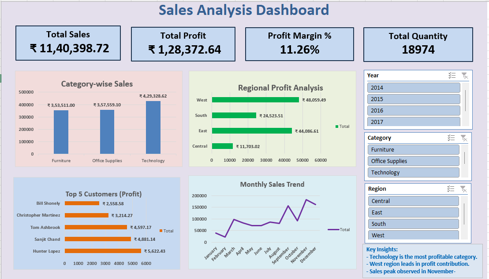

# 📊 Excel Sales Analysis Dashboard

This project is an **interactive Excel Dashboard** built using the Superstore dataset.  
It provides key insights into sales, profit, and customer performance across categories, regions, and time periods.  

---
## 🎥 Project Demo
Watch the interactive dashboard in action:  
[

---
## 🎥 Dashboard Demo
Watch the interactive dashboard demo here:  
[▶️ View Video on Google Drive]([https://drive.google.com/file/d/FILE_ID/view?usp=sharing](https://drive.google.com/file/d/1zGbbP3LBL6iZ5HMh_fdf2ZwG8_E9DiKn/view?usp=drive_link))

---

## 🚀 Features
- **KPIs (Cards):**
  - Total Sales
  - Total Profit
  - Profit Margin %
  - Total Quantity
- **Charts:**
  - Category-wise Sales
  - Regional Profit Analysis
  - Top 5 Customers by Profit
  - Monthly Sales Trend
- **Interactive Slicers:**
  - Year
  - Category
  - Region
- **Key Insights:**
  - Technology is the most profitable category.  
  - West region leads in profit contribution.  
  - Sales peak observed in November–December.  

---

## 📸 Dashboard Preview

---

## 🛠 Tools Used
- Microsoft Excel  
  - PivotTables  
  - PivotCharts  
  - Slicers  

---

